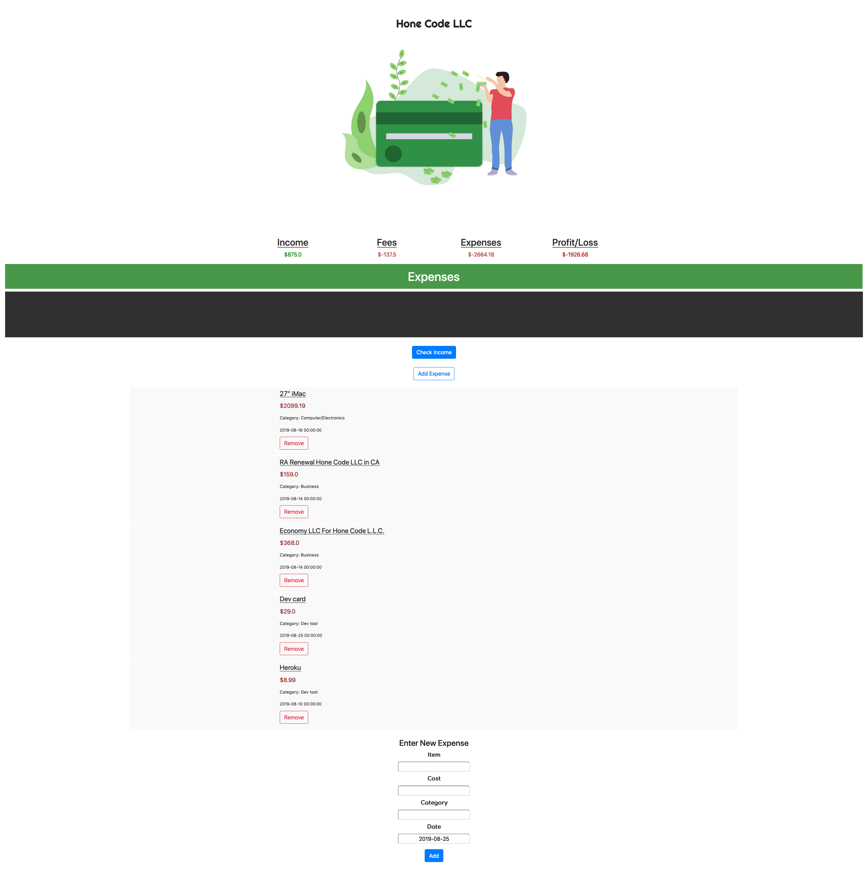

# Business Tracker
> Track income and expenses of your freelancing business

This software is designed to help organize income and expenses, with freelancers in mind. 

## Current features
- Add income from csv files generated on UpWork.com
- Add/remove expenses
- Keep a running total of income, fees, expenses

## Local Installation

- Clone this repository to a local directory
- cd to the directory where requirements.txt is located.
- Activate your virtualenv.
- Run: 
```sh
pip install -r requirements.txt
```
in your shell

- You will also need to install MongoDB. https://docs.mongodb.com/manual/administration/install-community/
- Make sure you are in the directory where app.py is located 


- Run the following command

```sh
flask run
```

- Go to 127.0.0.1:5000 or localhost:5000 in your webbrowser


You're all set!

# Sign-up
If you don't want/need to do a local install you can create an account on the live website here – [IncomeTracker](https://incometracker.herokuapp.com)


## Expenses



## Income
Accepts CSV from UpWork transaction history


### Take a look at the latest version here – [IncomeTracker](https//incometracker.herokuapp.com)
## Release History
* 0.3.0 dashboard added
* 0.2.1 patched remove item bug
* 0.2.0 data visualizations for expenses added
* 0.1.2 added manual income input, remove expense/income
* 0.1.1 added Users login/registration
* 0.1.0 init

## Meta

Joseph Villavicencio – [@Hone1er](https://twitter.com/hone1er)

                    GNU GENERAL PUBLIC LICENSE
                       Version 3, 29 June 2007
